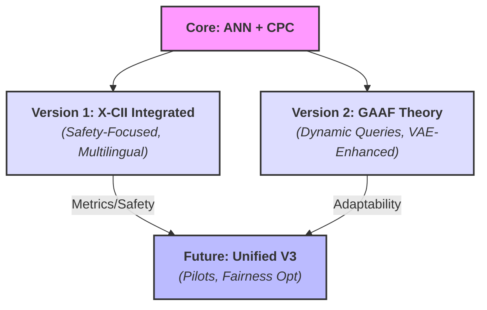

# Draco AgentTech Synthesis Framework

Authored by Torisan Unya (Independent Researcher, ORCID: [0009-0004-7067-9765](https://orcid.org/0009-0004-7067-9765)).
Licensed under **MIT + Patent License Addendum** (see [License](#license)).

This repository hosts the **Draco AgentTech Synthesis Framework**, a versatile agentic AI architecture for real-time analysis, decision support, and synthesis across domains. It features two versions integrating Collective Predictive Coding (CPC), Agentic Neural Networks (ANN), and human-AI collaboration principles. As part of the **[Agora-Supercluster](https://github.com/torisan-unya/Agora-Supercluster)**, Draco prioritizes ethical, adaptive, and transparent synergies.

**Elevator Pitch:** An advanced AI framework designed to navigate complexity. It deploys a team of specialized agents to rapidly gather, analyze, and synthesize vast information, delivering clear and reliable insights to support your critical decisions.

**Project Status & Vision:** This is a conceptual project consisting of prompt-based blueprints for advanced LLMs (e.g., Grok, GPT-4o, Claude). Simulations are illustrative and do not represent empirical claims. Last conceptual update: Oct 2025 (v1.1), refining clarity and incorporating analogs from recent research (e.g., arXiv:2508.14825 on agentic AI in HAC).

<details>
<summary>Key Terms Glossary</summary>
<ul>
<li><b>ANN (Agentic Neural Network)</b>: Dynamic network treating agents, tools, and models as nodes for forward/backward optimization.</li>
<li><b>CPC (Collective Predictive Coding)</b>: Decentralized inference minimizing group-level prediction errors via shared representations.</li>
<li><b>X-CII</b>: Extended Collaborative Intelligence Index; aggregates quality (Q), efficiency (E), and safety (S) via Box-Cox (λ=0.25).</li>
<li><b>GAAF</b>: Grand Unified Agentic Analysis Framework; self-organizing agents for adaptive analysis.</li>
<li><b>VAE-DRL Hybrid</b>: Variational Autoencoder for synthetic data + Deep Reinforcement Learning for strategy optimization.</li>
</ul>
</details>

---

## Framework Versions: Choose Your Approach

Draco has evolved from GAAF prototypes into two general-purpose editions, with a unified version planned for the future. This diagram illustrates the evolution:



Draco offers two distinct versions, each tailored for different analytical needs. Choose the one that best fits your objective.

- [**Version 1 (with X-CII): The Guardian for Critical Decisions**](./prompts/en/draco-agenttech-synthesis-framework-x-cii-en.md)
  This version is your choice for tasks where **risk management, reliability, and accountability** are non-negotiable. It operates like a meticulous auditor, quantifying performance and minimizing the cost of errors.

  - **Use When You Need:**
    - **Risk-Sensitive Analysis:** To explicitly calculate and minimize the potential cost of wrong decisions (Expected Loss).
    - **Quantifiable Proof:** To evaluate performance using a unified metric for Quality, Efficiency, and Safety (X-CII).
    - **High-Stakes Reliability:** For domains like healthcare, finance, or legal research where accuracy is paramount.
  - **Output Focus:** Delivers quantitative scores, comparison tables, and detailed logs suitable for auditing and verification.

- [**Version 2 (with GAAF): The Explorer for Dynamic Landscapes**](./prompts/en/draco-agenttech-synthesis-framework-gaaf-en.md)
  This version is built for navigating **ambiguity, complexity, and rapid change**. It functions like a team of expert analysts debating a topic to uncover deep patterns and generate novel insights.

  - **Use When You Need:**
    - **Adaptive Exploration:** To analyze evolving topics where the framework must dynamically adjust its approach.
    - **Deep Interpretability:** To understand the "why" behind an analysis through a consensus-building process among AI agents (CPC).
    - **Creative & Strategic Insight:** For market analysis, policy forecasting, or brainstorming new strategies where there is no single right answer.
  - **Output Focus:** Provides a narrative of the analytical process, detailed footnotes with evidence, and ethical checks, emphasizing transparency of reasoning.

---

## Getting Started

- **Quick Start**: Copy the prompt from a Markdown file into a capable LLM (e.g., Grok-1.5+, GPT-4o). Provide a theme like "Impact of AI on global trade" to begin.
- **Implementation**: The framework utilizes `code_execution` for simulations (e.g., ANN passes). It requires a Python environment with NumPy/SciPy; an Acklam fallback is included for `ndtri`.
- **Customization**: Adjust parameters directly in the prompt, such as `uplift: 1.05` or `norm_mode: 'null'`.
- **Contribute**: We welcome issues and PRs for refinements (e.g., new languages, domain adaptations). Test changes with Monte Carlo simulations (500-1000 reps; use a seed for reproducibility).
- **Citation**: Unya, T. (2025). Draco AgentTech Synthesis Framework. GitHub. https://github.com/torisan-unya/DRACO/.

---

## Conceptual Basis & Related Work

- HAIC Framework (arXiv:2407.19098v4, 2025): Methodological review for human-AI evaluation.
- Semantic Entropy for Hallucinations (Nature, 2024; DOI: 10.1038/s41586-024-07421-0): AUROC baselines.
- HCHAC (arXiv:2505.22477v2, 2025): Human-centered relationships.
- **2025 Analogs**: These preprints inform the framework's concepts: Agentic AI in Collaborative Learning (arXiv:2508.14825); Orchestrating Human-AI Teams (arXiv:2510.02557); AIssistant for HAC Scientific Work (arXiv:2509.12282); Unified HAC in Security (arXiv:2505.23397); Development of Mental Models in HAC (arXiv:2510.08104).

---

## Roadmap & Future Vision

- **Unified V3**: Merge X-CII safety with GAAF adaptability; add group-adaptive thresholds and fairness-aware optimization.
- **Empirical Pilots**: Conduct N=200-500 tests in finance/healthcare, integrating the IRIS framework.
- **Community Growth**: Encourage PRs for code, visualizations, and new analogs (e.g., arXiv:2505.11684).
- **Preprint Plans**: Submit refined versions to TechRxiv/arXiv sequentially.

---

## Keywords

**Core Concepts:** Agentic AI, ANN, CPC, X-CII, GAAF.
**Methods:** Forward/Backward Optimization, VAE-DRL, Expected Loss, Multilingual Fidelity.
**Applications:** Analysis Synthesis, Decision Support, Human-AI Collaboration.
**Meta-Aspects:** Prompt Engineering, Ethical AI.

---

## Acknowledgments

Developed via human-AI collaboration (Grok, Gemini, ChatGPT, Claude). Inspired by GAAF and X-CII from the Agora-Supercluster. Related to the DRACO project for advanced agentic simulations (https://github.com/torisan-unya/DRACO/).

---

## License

This project uses a **dual license structure (MIT + Patent License Addendum)** to ensure both openness and legal clarity for all users and contributors. It maintains consistency with actively developed projects and governs all present and future code contributions.

The complete license agreement consists of the following two documents:

- **[`LICENSE.md`](LICENSE.md)** — The primary copyright license under the [MIT License](https://opensource.org/licenses/MIT).
- **[`PATENT_LICENSE_ADDENDUM.md`](PATENT_LICENSE_ADDENDUM.md)** — An integrated addendum granting a license to contributors’ essential patent claims.

---

### 🔹 For Users

You may use, modify, and distribute this software under the **MIT License**, supplemented by a **patent license** from all contributors. This dual structure provides enhanced **legal protection and clarity** for every user.

---

### 🔹 For Contributors

Thank you for your contributions! Please note that by submitting any "Contribution" (e.g., a pull request or patch), you **explicitly agree** to the terms of both license documents listed above, including the **patent grant and defensive termination clause** in [`PATENT_LICENSE_ADDENDUM.md`](PATENT_LICENSE_ADDENDUM.md).

This ensures the continued protection and sustainability of the project and its community.
```
