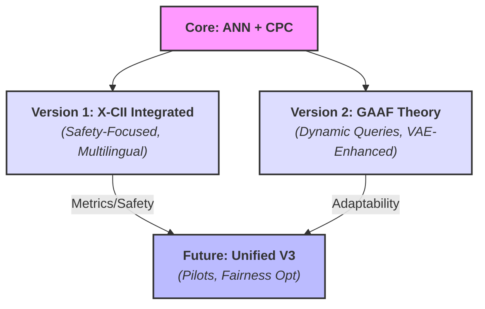

# Draco AgentTech Synthesis Framework

Authored by Torisan Unya (Independent Researcher, ORCID: [0009-0004-7067-9765](https://orcid.org/0009-0004-7067-9765)). 
Licensed under **MIT + Patent License Addendum** (see [License](#license)).

This repository hosts the **Draco AgentTech Synthesis Framework**, a versatile agentic AI architecture for real-time analysis, decision support, and synthesis across domains like finance, policy, and creativity. It features two versions integrating Collective Predictive Coding (CPC), Agentic Neural Networks (ANN), and human-AI collaboration principles. As part of the **[Agora-Supercluster](https://github.com/torisan-unya/Agora-Supercluster)**, Draco prioritizes ethical, adaptive, and transparent synergies.

**Elevator Pitch:** A self-evolving AI agent team that debates, predicts, and refines insights like a dynamic brain—delivering clear, verifiable results with humans at the center.

**Notice and Updates:** Conceptual project; prompt-based blueprints for LLMs (e.g., Grok, GPT-4o, Claude). Simulations illustrative; no empirical claims. Updated October 15, 2025 (Version 1.1): Refined for clarity; added 2025 arXiv analogs from search (e.g., arXiv:2508.14825 on agentic AI in HAC).

Key Terms Glossary

<ul>
<li><b>ANN (Agentic Neural Network)</b>: Dynamic network treating agents, tools, and models as nodes for forward/backward optimization.</li>
<li><b>CPC (Collective Predictive Coding)</b>: Decentralized inference minimizing group-level prediction errors via shared representations.</li>
<li><b>X-CII</b>: Extended Collaborative Intelligence Index; aggregates quality (Q), efficiency (E), and safety (S) via Box-Cox (λ=0.25).</li>
<li><b>GAAF</b>: Grand Unified Agentic Analysis Framework; self-organizing agents for adaptive analysis.</li>
<li><b>VAE-DRL Hybrid</b>: Variational Autoencoder for synthetic data + Deep Reinforcement Learning for strategy optimization.</li>
</ul>

---

## Framework Evolution and Core Versions

Draco builds from GAAF prototypes to general-purpose editions:

- **Version 1 ([Draco with X-CII](./prompts/en/draco-agenttech-synthesis-framework-x-cii-en.md))**: Emphasizes safety via SDT and Expected Loss; multilingual (EN/JA/ZH/FR/ES/PT/KO) with fidelity scaling. Metrics: Median Relative X-CII ~107.2% [95% CI: 106.0-109.0%]; AUROC ~0.75-0.85. Use: High-stakes (e.g., healthcare explainability). Prompt: AI Proposal Mode; outputs summaries, tables, logs.
- **Version 2 ([Draco with GAAF](./prompts/en/draco-agenttech-synthesis-framework-gaaf-en.md))**: Focuses on dynamic thresholds and interpretability; VAE for synthetic data and CPC for consensus. Metrics: Variance/error thresholds (0.02-0.07); CAG scores ≥14/20. Use: General (e.g., market impacts). Prompt: AI Proposal Mode; outputs phases, footnotes, ethical checks.

---

## How to Use This Repository

- **Quick Start**: Copy prompt from Markdown file into LLM (e.g., Grok-1.5+). Provide theme like "Impact of AI on global trade".
- **Implementation**: Use code_execution for simulations (e.g., ANN passes). Requires Python with NumPy/SciPy; Acklam fallback for ndtri.
- **Customization**: Adjust parameters (e.g., uplift +5%, norm_mode 'null').
- **Contribute**: Issues/PRs for refinements (e.g., languages, domains). Test with Monte Carlo (500-1000 reps; seed for reproducibility).
- **Cite**: Unya, T. (2025). Draco AgentTech Synthesis Framework. GitHub. [URL].

---

## Real-World Analogs and Related Papers

- HAIC Framework (arXiv:2407.19098v4, 2025): Methodological review for human-AI evaluation.
- Semantic Entropy for Hallucinations (Nature, 2024; DOI: 10.1038/s41586-024-07421-0): AUROC baselines.
- HCHAC (arXiv:2505.22477v2, 2025): Human-centered relationships.
- **New 2025 Analogs (from arXiv search)**: Agentic AI in Collaborative Learning (arXiv:2508.14825); Orchestrating Human-AI Teams (arXiv:2510.02557); AIssistant for HAC Scientific Work (arXiv:2509.12282); Unified HAC in Security (arXiv:2505.23397); Development of Mental Models in HAC (arXiv:2510.08104).

---

## Future Extensions

- **Unified V3**: Merge X-CII safety with GAAF adaptability; add group-adaptive thresholds (AUROC sensitivity) and fairness (EOD L_inf ~0.02).
- **Empirical Pilots**: N=200-500 tests in finance/healthcare; integrate IRIS.
- **Community**: PRs for code, visualizations, analogs (e.g., arXiv:2505.11684 for community HAC).
- **Preprint Plans**: Submit refined versions to TechRxiv/arXiv sequentially.

---

## Keywords

**Core Concepts:** Agentic AI, ANN, CPC, X-CII, GAAF.  
**Methods:** Forward/Backward Optimization, VAE-DRL, Expected Loss, Multilingual Fidelity.  
**Applications:** Analysis Synthesis, Decision Support, Human-AI Collaboration.  
**Meta-Aspects:** Prompt Engineering, Ethical AI.

---

## Acknowledgments

Developed via human-AI collaboration (Grok, Gemini, ChatGPT, Claude). Inspired by GAAF and X-CII from Agora-Supercluster.

---

## License

This project uses a **dual license structure (MIT + Patent License Addendum)** to ensure both openness and legal clarity for all users and contributors.  
It maintains consistency with actively developed projects and governs all present and future code contributions.

The complete license agreement consists of the following two documents:

- **[`LICENSE.md`](LICENSE.md)** — The primary copyright license under the [MIT License](https://opensource.org/licenses/MIT).  
- **[`PATENT_LICENSE_ADDENDUM.md`](PATENT_LICENSE_ADDENDUM.md)** — An integrated addendum granting a license to contributors’ essential patent claims.

---

### 🔹 For Users

You may use, modify, and distribute this software under the **MIT License**,  
supplemented by a **patent license** from all contributors.  
This dual structure provides enhanced **legal protection and clarity** for every user.

---

### 🔹 For Contributors

Thank you for your contributions!  
Please note that by submitting any "Contribution" (e.g., a pull request or patch),  
you **explicitly agree** to the terms of both license documents listed above,  
including the **patent grant and defensive termination clause** in  
[`PATENT_LICENSE_ADDENDUM.md`](PATENT_LICENSE_ADDENDUM.md).

This ensures the continued protection and sustainability of the project and its community.
